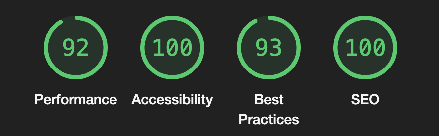

# Aviation Monopoly 

Aviation Monopoly is a platform dedicated to providing insights into the aviation industry's foremost players, Airbus and Boeing. Tailored for users seeking deeper comprehension of these industry leaders' histories and fleet compositions.

Aviation Monopoly looks into the origins and significant milestones that have shaped Airbus and Boeing into the globally renowned entities they are today. Users keen on exploring the specifics of each manufacturer's commercial aircraft can seamlessly navigate through the website. These pages furnish essential statistics about the companies and detailed information regarding their respective most popular aircraft model. Additionally, images facilitate easy differentiation between various aircraft variants, enhancing the user experience.

The live link can be found here - [Aviation Monopoly](https://bryangon13.github.io/Aviation-Monopoly/)

## Site Owner Goals 

- To offer users insights into the remarkable achievements and innovations of aviation giants Airbus and Boeing, with a specific emphasis on their historical significance and diverse fleet offerings.
- To guide users through the rich history and extensive commercial aircraft catalog of both manufacturers with clear and concise instructions, detailed statistics, images, and key information provided for each aircraft model.
- To prioritize delivering a seamless and calming user experience, ensuring easy navigation, full responsiveness across devices.
- To invite aviation enthusiasts to contribute their insights, suggestions, and feedback.

## User Stories
- ### First time user
  - As a first time user I want to understand the main purpose of the site and learn about the history of Airbus and Boeing.
  - As a first time user I want to be able to intuitively navigate the website and have a positive experience. 
  - As a first time user I want to be able to browse aviation content without having to sign-up / register.
 
- ### Returning User
  - As a returning user I want to easily navigate to a specific historic event in the company's history.  
  - As a returning user I want to find information about the most popular aircrafts in today's world.
  - As a returning user, I aim to revisit captivating images of aircraft models while refreshing my memory on their essential statistics.
 
- ### Frequent User
  - As a frequent user I want to be able to ask questions or submit suggestions about the aviation industry.
 
## Design

### Imagery
The visuals featured on the Aviation Monopoly website play a crucial role in enhancing the user's overall experience. We maintain a clean and academic white background, providing a canvas for various sections distinguished by different shades of green. This deliberate choice not only ensures visual clarity but also adds a touch of sophistication, contributing to a seamless and engaging browsing experience for our users.

### Colours
The colour scheme of the website is white with varying shades of green used to tie in pictures of aircrafts. A dark grey font is used which has a good contrast with the light green and white backgrounds making it easy to read. 

### Fonts
The Roboto font is the main font used throughout the whole website. This font was imported via [Google Fonts](https://fonts.google.com/). I'm using Sans Serif as a backup font, in case for any reason the main font isn't being imported into the site correctly.

## Wireframes
Wireframes were produced using Balsamiq. 

 

 
Desktop Wireframe

 

 

    
Mobile Wireframe

 

## Features
- ### Navigation

    - The fully responsive navigation bar includes links to the Logo, Home, About, Poses, Practice and Contribute sections of the same page.
    - The Poses navigation link includes a drop down menu which includes further links to each emotional state within the Poses section.
    - The navigation bar has a fixed position so that it remains visible at the top of the page as the user navigates through the individual sections. 
    - A drop shadow was applied to the navigation bar to make sure that it doesn't blend into the other sections of the page upon scrolling.
    - This section allows the user to easily navigate through the site to find content without having to scroll back up to the top of the page or use the browser back button.

- ### Landing Page Image

    - The landing page includes an eye-catching image with a text overlay describing the site's goal.
    - This section provides the user with a clear visual representation of the purpose of the site.

- ### About Section

    - Provide users with a captivating journey through the aviation industry, uncovering the remarkable milestones of Airbus and Boeing while highlighting their significant contributions to aviation history, technology, design, and efficiency.
    - Invite aviation enthusiasts, history aficionados, and those intrigued by flight to explore the enduring legacies of Airbus and Boeing, delving into their monumental contributions that have shaped and revolutionized the world of aviation.

- ### Milestones Section

    - Within this section, significant milestones in aviation history are curated, offering invaluable insights for aviation enthusiasts.
    - This segment holds great value as users are presented with key events that have shaped the aviation industry into what it is today, providing a deeper understanding of its evolution.

- ### Contact Us Section

    - The "Contact Us" section serves as a vital avenue for users to engage with us, fostering open communication and enabling us to address their inquiries or feedback promptly.
    - The "Contact Us" section also provides users with a direct channel to reach out to us for any assistance they may need, ensuring a personalized and responsive experience tailored to their needs.

- ### Footer

    - The footer section includes links to our Facebook, Instagram, Twitter and Youtube pages.
    - The links will open to a new tab to allow easy navigation for the user. 
    - The footer is valuable to the user as it allows them to find and follow us on social media.

### Features Left to Implement

- Burger button for the mobile nav bar.
- Update to commercial aircraft fleet and include cargo aircrafts.

### Validator Testing

- #### HTML

    - No errors were returned when passing through the official W3C Markup Validator.
    - [W3C Validator Results](https://validator.w3.org/nu/?doc=https%3A%2F%2Fbryangon13.github.io%2FAviation-Monopoly%2F)

- #### CSS

    - No errors were found when passing through the official W3C CSS Validator. 
    - [W3C CSS Validator Results](https://jigsaw.w3.org/css-validator/validator?uri=https%3A%2F%2Fbryangon13.github.io%2FAviation-Monopoly%2F&profile=css3svg&usermedium=all&warning=1&vextwarning=&lang=en#css)

- #### Accessibility 

    - The site achieved a Lighthouse accessibility score of 93% which confirms that the colours and fonts chosen are easy to read and accessible.

### Form Testing

- The form has been tested to ensure it would not submit without the required input fields being filled in (full name and email address).

### Links Testing

- All navigation links were tested manually to ensure the user is directed to the correct section of the website.
- Social Media links in the footer of each page were tested manually to ensure they direct the user to the correct page and open in a new tab. 

### Device Testing

- The website was viewed on a variety of devices such as Desktop, Laptop, iPhone 8, iPhoneX and iPad to ensure responsiveness on various screen sizes. The website performed as intended. The responsive design was also checked using Chrome developer tools across multiple devices with structural integrity holding for the various sizes.
- I also used the following websites to test responsiveness:
    - [Responsinator](http://www.responsinator.com/?url=https%3A%2F%2Faliokeeffe.github.io%2Fmindyoga%2F)
    - [Am I Responsive](http://ami.responsivedesign.is/?url=https%3A%2F%2Faliokeeffe.github.io%2Fmindyoga%2F)

